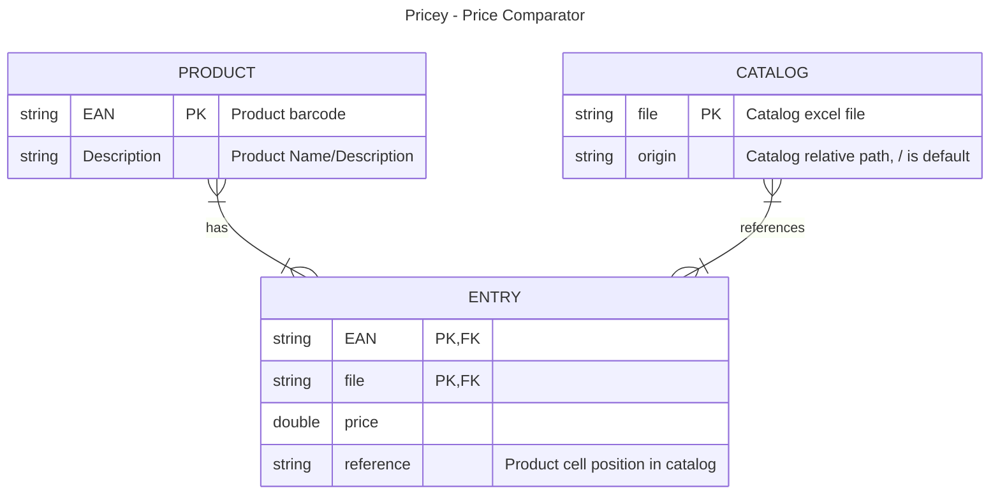

# Pricey
Pricey compares prices read from excel files.

The comparator has been created for a commercial activity, also, the excel files do not follow a standard. Thus, the code was developed to adapt to the 
format of certain files.   
As a consequence, the comparator will most likely won't be able to adapt to the excel files that have a different structure from the 
tested files.

The application was initially written in pure Java and then using the Spring framework.

It open an interactive webpage at the address ``localhost:8080``, in particular:
- You can set the relative or absolute path of the excel files (it defaults to the relative folder where the final catalog is stored).
- Upload one or more excel files simultaneously.
- Download a zip file containing the ordered catalog.

The catalog will have all the products with their relative prices in ascending order. Furthermore, each product will be linked to the file containing that specific price.

Note: the link won't work if the set path is not valid.

## Database Setup
Pricey runs mariaDB as DBMS. Before building the code and launching you should create a database and a user.
```sql
CREATE DATABASE 'PriceyDB';
CREATE USER 'pricey'@'localhost' IDENTIFIED BY 'YOUR-PASSWORD';
GRANT ALL PRIVILEGES ON 'PriceyDB'.* TO 'pricey'@'localhost';
FLUSH PRIVILEGES;
```
Next, edit the username and password fields of the resources/application.yaml file to match the ones you've just created.

## Usage
Go in the project root folder open a terminal and type `mvn package`, you will find your jar file in the target folder.  


Create the files and Listino folders (yes i know, it should do this automatically but i'm lazy) and then launch the application.

```console
mvn package
cd target
mkdir files Listino
java -jar pricey-2.x.jar
```

## E-R Database

